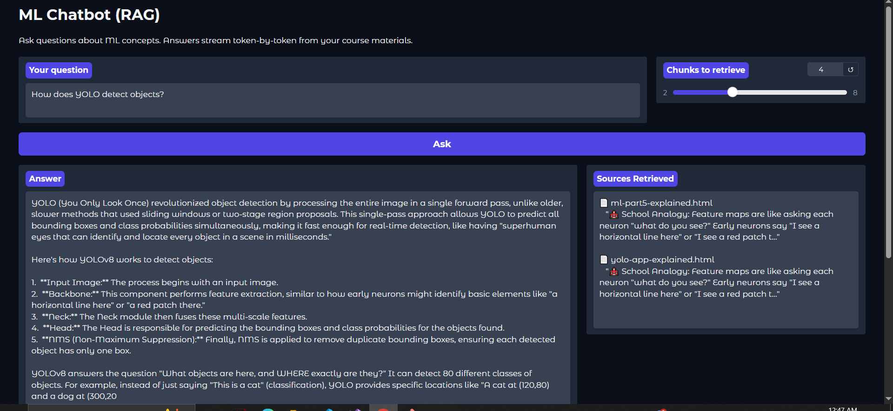
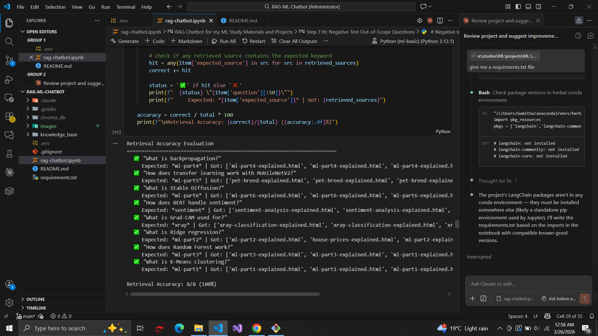

# 🤖 RAG ML Chatbot

A Retrieval-Augmented Generation chatbot that answers machine learning questions by searching through my learning and project explanation files. Built with LangChain, ChromaDB, and Gemini, achieving 100% retrieval accuracy and 0% hallucination rate.

> **💡 [View the Interactive Explanation →](https://htmlpreview.github.io/?https://github.com/GamithaManawadu/RAG-ML-Chatbot/blob/main/Explanations/rag-chatbot-explained.html)**

<p align="center">
  
  
</p>

## What Is RAG?

RAG (Retrieval-Augmented Generation) solves the biggest problem with chatbots: hallucination. A regular LLM might confidently make up an answer. A RAG chatbot first searches for relevant information from a knowledge base, then generates an answer only from what it found. This means every answer is grounded in actual source material, and the chatbot correctly says "I don't know" when asked about topics outside its knowledge base.

## Knowledge Base

The chatbot's knowledge comes from 14 interactive HTML explanation files covering the complete ML learning journey. These include six course parts (ML fundamentals, regression, classification, neural networks, advanced CNNs with YOLO, and generative AI with LLMs), plus practice project explanations for sentiment analysis, medical X-ray classification, dogs vs cats, pet breed classification, house price prediction, YOLO web app, and two fake news detection projects. The total knowledge base contains 155,855 characters of educational content.

## How It Works

The pipeline has six stages. First, UnstructuredHTMLLoader from LangChain extracts clean text from the 14 HTML files, automatically stripping all tags and styling. Second, RecursiveCharacterTextSplitter divides the text into 254 chunks of approximately 800 characters each, with 100-character overlap to preserve context at boundaries. Third, all-MiniLM-L6-v2 converts each chunk into a 384-dimensional vector that captures its semantic meaning. Fourth, ChromaDB stores these 762 vectors in a persistent local database. Fifth, when a user asks a question, it gets embedded and the 4 most semantically similar chunks are retrieved. Sixth, these chunks plus the question are sent to Gemini with a custom prompt that instructs it to answer ONLY from the provided context, producing a grounded answer with source citations.

## Results

The chatbot was evaluated on two dimensions. For retrieval accuracy, 8 test questions with known expected source files were used, and the retriever correctly found chunks from the right source for all 8 (100% accuracy). For hallucination testing, 6 out-of-scope questions (quantum computing, Roman history, sourdough bread, blockchain, combustion engines) were asked, and the chatbot correctly refused to answer all 6, achieving a 0% hallucination rate.

| Metric               | Value                |
| -------------------- | -------------------- |
| Knowledge base files | 14                   |
| Total chunks         | 254                  |
| Vector dimensions    | 384                  |
| Vectors in ChromaDB  | 762                  |
| Retrieval accuracy   | **100%** (8/8)       |
| Hallucination rate   | **0%** (6/6 refused) |

## Key Findings

**Smaller embeddings won.** all-MiniLM-L6-v2 (384 dims) achieved 100% retrieval accuracy, outperforming BAAI/bge-base-en-v1.5 (768 dims) which scored 88%. The smaller model was specifically trained for semantic similarity using contrastive learning on 1 billion sentence pairs, making it a better fit for retrieval than the larger general-purpose model. This demonstrates that task-specific training matters more than model size.

**Chunk size has a sweet spot.** 400-character chunks scored only 88% retrieval accuracy because they lacked enough context for the embedding model. Sizes from 600 to 1200 characters all achieved 100%. The final choice of 800 characters balances precision (chunks are focused on one topic) with context (chunks contain enough information to be useful).

**Negative testing is essential.** Proving the chatbot says "I don't know" when asked about topics outside its knowledge base is just as important as proving it answers correctly. The relevance scores for out-of-scope questions were all near zero or negative (e.g., "Roman Empire" scored -0.164), confirming the embedding model correctly identifies irrelevant queries.

## Tech Stack

| Component       | Choice                         | Why                                                            |
| --------------- | ------------------------------ | -------------------------------------------------------------- |
| Document Loader | UnstructuredHTMLLoader         | LangChain community loader, handles HTML parsing automatically |
| Text Splitter   | RecursiveCharacterTextSplitter | Splits on paragraph/sentence boundaries, preserves coherence   |
| Embeddings      | all-MiniLM-L6-v2               | Beat larger model (100% vs 88%), runs locally, no API needed   |
| Vector Store    | ChromaDB                       | Lightweight, local, persistent, no external server             |
| LLM             | Gemini 2.5 Flash               | Free tier API, fast, good instruction following                |
| Framework       | LangChain (LCEL)               | Modern composable chains for RAG pipelines                     |
| UI              | Gradio                         | Shareable web UI with example questions                        |

## Setup

```bash
pip install -r requirements.txt
```

Create a `.env` file with your API key:

```
GOOGLE_API_KEY=your_key_here
```

## Project Structure

```
RAG-ML-Chatbot/
├── rag-chatbot.ipynb        # Main notebook
├── knowledge_base/          # HTML explanation files
├── chroma_db/               # Persisted vector store (auto-generated)
├── Explanations/
│   └── rag-chatbot-explained.html
├── .env                     # API key (not uploaded to git)
├── .gitignore
├── requirements.txt
├── README.md
└── images/
    ├── gradio_demo.png
    └── retrieval_accuracy.png
```

## Technologies

LangChain, ChromaDB, Sentence-Transformers, UnstructuredHTMLLoader, Gemini API, Gradio, Python
